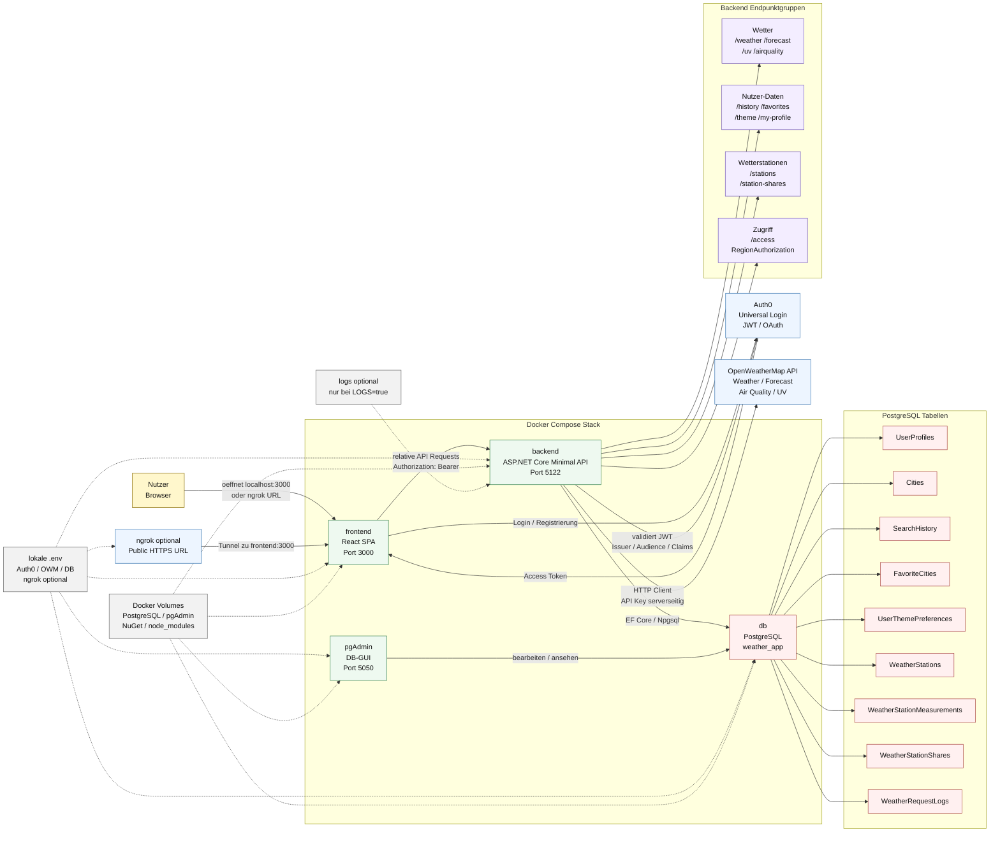

# Architekturdiagramm

Dieses Diagramm zeigt die Laufzeitarchitektur der Weather App. Es nutzt Mermaid
`flowchart`-Syntax, weil diese in Markdown stabil und breit unterstuetzt ist.

Mermaid-Regeln, die hier bewusst eingehalten werden:

- Das Diagramm beginnt mit dem Diagrammtyp `flowchart`.
- `LR` setzt die Leserichtung von links nach rechts.
- Zusammengehoerige Teile werden mit `subgraph` gruppiert.
- Labels mit Leerzeichen, Slashs oder Sonderzeichen stehen in Anfuehrungszeichen.
- Kommentare stehen auf eigenen Zeilen und beginnen mit `%%`.
- Der Knotenname `end` wird nicht verwendet, weil Mermaid das als Blockende lesen kann.

## Lesart

1. Der Nutzer oeffnet das React-Frontend lokal oder ueber den optionalen
   ngrok-Tunnel.
2. Das Frontend leitet Login und Registrierung an Auth0 weiter.
3. Auth0 gibt ein Access Token zurueck.
4. Das Frontend ruft das Backend ueber relative API-Pfade auf und sendet das
   Token als Bearer Token mit.
5. Das Backend validiert das Token, prueft Region-Permissions und fuehrt
   fachliche REST-Endpunkte aus.
6. Wetterdaten kommen serverseitig von OpenWeatherMap. Der API-Key liegt nicht
   im Frontend.
7. Favoriten, Verlauf, Themes, Wetterstationen, Messwerte und Freigaben werden
   per EF Core in PostgreSQL gespeichert.
8. pgAdmin verbindet sich innerhalb des Docker-Netzwerks mit PostgreSQL.
9. Docker-Volumes halten Daten und Entwicklungsabhaengigkeiten ausserhalb des
   Git-Repositories.

## Mermaid-Quellen

- Mermaid Architecture Diagrams: https://mermaid.js.org/syntax/architecture.html
- Mermaid Flowchart Syntax: https://mermaid.js.org/syntax/flowchart.html
- Mermaid Syntax Reference: https://mermaid.js.org/intro/syntax-reference.html
