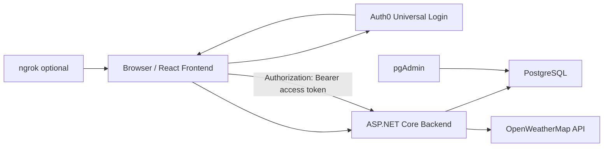

# Weather App

Containerisierte Wetterdaten-Plattform mit React-Frontend, ASP.NET-Core-Minimal-API, PostgreSQL, pgAdmin, Auth0-Login und OpenWeatherMap-Anbindung.

Das Projekt ist so vorbereitet, dass ein frischer Clone mit lokaler `.env` über Docker Compose startet. Echte Secrets liegen nur lokal in `.env` und werden nicht in Git aufgenommen.

## Inhalt

- React-Weboberfläche für Wetterdaten, Favoriten, Suchverlauf, Themes und eigene Wetterstationen.
- ASP.NET-Core-Backend mit REST-Endpunkten.
- PostgreSQL-Datenbank mit EF Core als ORM.
- pgAdmin zur Ansicht und Bearbeitung der Datenbank.
- Auth0 Universal Login mit Benutzername/Passwort und Social Login.
- OpenWeatherMap als externe Wetterdatenquelle.
- Optionaler ngrok-Tunnel für öffentlichen Zugriff auf das lokale Frontend.
- Optionale ausführliche Backend-Datei-Logs.

## Voraussetzungen

- Docker Desktop oder Docker Engine mit Docker Compose.
- Auth0 Account: https://auth0.com/
- OpenWeatherMap API Key: https://openweathermap.org/api
- Optional ngrok Account und Authtoken: https://ngrok.com/

## Schnellstart

Repository klonen:

```sh
git clone https://github.com/peterschmid04/weather-app.git
cd weather-app
```

Wenn noch keine `.env` existiert, kann eine Startdatei die wichtigsten Werte abfragen und `.env` anlegen.

Windows:

```powershell
.\start-weather-app.bat
```

Windows PowerShell direkt:

```powershell
.\start-weather-app.ps1
```

macOS oder Linux:

```sh
sh ./start-weather-app.sh
```

Wenn `.env` bereits existiert, fragen die Scripts nichts erneut ab und starten direkt:

```sh
docker compose up -d
```

## Manuelle Einrichtung

`.env.example` kopieren:

```sh
cp .env.example .env
```

Windows PowerShell:

```powershell
Copy-Item .env.example .env
```

Dann `.env` ausfüllen und starten:

```sh
docker compose up -d
```

Wichtige URLs:

- Frontend: http://localhost:3000
- Backend Swagger: http://localhost:5122/swagger
- pgAdmin: http://localhost:5050
- PostgreSQL vom Host: `localhost:5432`
- PostgreSQL aus Docker/pgAdmin: `db:5432`

## `.env`

Die `.env` liegt im Repository-Root, wird aber durch `.gitignore` ignoriert. Dort stehen lokale Secrets und lokale Startoptionen.

Beispiel:

```env
POSTGRES_DB=weather_app
POSTGRES_USER=weather_app
POSTGRES_PASSWORD=change-me-for-local-development

PGADMIN_DEFAULT_EMAIL=admin@example.com
PGADMIN_DEFAULT_PASSWORD=change-me-for-local-development

AUTH0_DOMAIN=your-tenant.region.auth0.com
AUTH0_AUDIENCE=https://weather-api
AUTH0_CLIENT_ID=your-auth0-spa-client-id
AUTH0_SCOPE=openid profile email read:weather

AUTH0_CONNECTION_DATABASE=Username-Password-Authentication
AUTH0_CONNECTION_GOOGLE=google-oauth2
AUTH0_CONNECTION_APPLE=apple
AUTH0_CONNECTION_FACEBOOK=facebook
AUTH0_CONNECTION_GITHUB=github

OPENWEATHERMAP_API_KEY=your-openweathermap-api-key

LOGS=false
LOG_DIRECTORY=/workspace/logs

NGROK_AUTHTOKEN=your-ngrok-authtoken
NGROK_URL=https://relaxed-yak-pleasantly.ngrok-free.app
```

Wichtig:

- Kein Auth0 Client Secret in dieses Projekt schreiben.
- React ist eine Single Page Application; sie braucht nur die Auth0 Domain, Audience und Client ID.
- Provider-Secrets für Google, Apple, Facebook und GitHub gehören in Auth0, nicht in `.env`.
- `.env.example` enthält nur Platzhalter.

## Auth0 Setup

Auth0 verwaltet Login, Registrierung, Passwort-Hashing, Salt, Social Login und Token-Ausstellung. Unsere Datenbank speichert keine Passwörter.

### 1. Auth0 Application

Im Auth0 Dashboard:

1. Links `Applications` öffnen.
2. `Applications` auswählen.
3. Weather-App öffnen oder neue App erstellen.
4. Typ: `Single Page Application`.
5. Tab `Settings` öffnen.

Diese Felder setzen:

```text
Allowed Callback URLs:
http://localhost:3000

Allowed Logout URLs:
http://localhost:3000

Allowed Web Origins:
http://localhost:3000
```

Danach unten `Save Changes`.

Wenn ngrok genutzt wird, zusätzlich die öffentliche ngrok URL eintragen:

```text
Allowed Callback URLs:
http://localhost:3000, https://relaxed-yak-pleasantly.ngrok-free.app

Allowed Logout URLs:
http://localhost:3000, https://relaxed-yak-pleasantly.ngrok-free.app

Allowed Web Origins:
http://localhost:3000, https://relaxed-yak-pleasantly.ngrok-free.app
```

Wenn Auth0 `Callback URL mismatch` anzeigt, sendet das Frontend eine `redirect_uri`, die in diesen Feldern noch nicht erlaubt ist. Lokal ist das normalerweise:

```text
http://localhost:3000
```

Mit ngrok ist es die öffentliche URL aus `NGROK_URL`, zum Beispiel:

```text
https://relaxed-yak-pleasantly.ngrok-free.app
```

Für den Tenant `dev-021n1l5l5ftyrnjp` bedeutet das: In der Auth0 Application genau diese lokale und/oder ngrok-URL bei `Allowed Callback URLs`, `Allowed Logout URLs` und `Allowed Web Origins` eintragen. Danach `Save Changes` drücken und den Login neu starten.

### 2. Auth0 API / Audience

Im Auth0 Dashboard:

1. Links `Applications` öffnen.
2. `APIs` auswählen.
3. API erstellen oder öffnen.
4. Identifier muss zur `.env` passen.

Beispiel:

```env
AUTH0_AUDIENCE=https://weather-api
```

### 3. Auth0 Werte für `.env`

Diese Werte aus Auth0 übernehmen:

```env
AUTH0_DOMAIN=dein-tenant.eu.auth0.com
AUTH0_CLIENT_ID=deine-spa-client-id
AUTH0_AUDIENCE=https://weather-api
```

`AUTH0_DOMAIN` und `AUTH0_CLIENT_ID` stehen bei `Applications -> deine App -> Settings`.

`AUTH0_AUDIENCE` ist der API-Identifier aus `Applications -> APIs`.

### 4. Login-Methoden aktivieren

Benutzername/Passwort:

1. `Authentication -> Database`.
2. `Username-Password-Authentication` öffnen oder erstellen.
3. Tab `Applications`.
4. Weather-App aktivieren.

Google, Apple, Facebook und GitHub:

1. `Authentication -> Social`.
2. `Create Connection`.
3. Provider wählen.
4. Provider Client ID und Client Secret eintragen.
5. Tab `Applications`.
6. Weather-App aktivieren.

Die Provider-Keys bekommst du beim jeweiligen Anbieter:

- Google: Google Cloud Console OAuth Client.
- Apple: Apple Developer Account.
- Facebook: Meta Developer App.
- GitHub: GitHub Developer Settings OAuth App.

Wichtig bei Google: Die Google OAuth App leitet nicht direkt auf `localhost:3000`, sondern auf Auth0 zurück. In Google Cloud muss deshalb als `Authorized redirect URI` die Auth0 Callback-URL eingetragen werden:

```text
https://AUTH0_DOMAIN/login/callback
```

Beispiel mit deinem Auth0-Tenant:

```text
https://dev-021n1l5l5ftyrnjp.<region>.auth0.com/login/callback
```

`<region>` durch die Region aus `AUTH0_DOMAIN` ersetzen, zum Beispiel `eu` oder `us`. Danach in Auth0 unter `Authentication -> Social -> Google` die Google Client ID und das Google Client Secret eintragen und die Weather-App im Tab `Applications` aktivieren.

Das Projekt nutzt im Frontend die Auth0 React SDK. Diese nutzt für SPAs den Authorization Code Flow mit PKCE. Das Backend validiert danach das JWT als `Authorization: Bearer <token>` mit ASP.NET Core JWT Bearer Authentication.

## OpenWeatherMap Setup

1. Konto bei OpenWeatherMap erstellen: https://openweathermap.org/api
2. API Key im OpenWeather Dashboard erzeugen.
3. Key lokal in `.env` eintragen:

```env
OPENWEATHERMAP_API_KEY=dein-openweathermap-key
```

Der Key wird nur an das Backend übergeben. Das Frontend bekommt den Key nicht direkt.

## Docker Compose Services

Docker Compose startet:

- `frontend`: React App auf Port `3000`.
- `backend`: ASP.NET Core API auf Port `5122`.
- `db`: PostgreSQL auf Port `5432`.
- `pgadmin`: pgAdmin auf Port `5050`.
- `ngrok`: optionales Profil, nur bei Bedarf.

Start:

```sh
docker compose up -d
```

Status:

```sh
docker compose ps
```

Logs:

```sh
docker compose logs -f frontend backend db pgadmin
```

Stoppen:

```sh
docker compose down
```

## PostgreSQL und pgAdmin

Die Datenbank wird vom offiziellen `postgres:latest` Container erstellt. Du musst die Datenbank nicht manuell anlegen.

Standardname:

```env
POSTGRES_DB=weather_app
```

Die Datenbankdateien liegen in einem Docker Volume und nicht im lokalen OneDrive-Projektordner.

pgAdmin:

1. http://localhost:5050 öffnen.
2. Mit `PGADMIN_DEFAULT_EMAIL` und `PGADMIN_DEFAULT_PASSWORD` aus `.env` einloggen.
3. Der Server `Weather PostgreSQL` ist vorbereitet.
4. Wenn pgAdmin nach dem DB-Passwort fragt: `POSTGRES_PASSWORD` aus `.env`.

### Hinweis zu `__EFMigrationsHistory`

Auf einem komplett neuen PC kann PostgreSQL beim ersten Start so eine Meldung ausgeben:

```text
ERROR: relation "__EFMigrationsHistory" does not exist
```

Das ist die EF-Core-Migrationstabelle. Der Stack enthält ein Postgres-Init-Script, das diese Tabelle auf frischen Datenbank-Volumes vorbereitet. Danach kann EF Core die Migrationen sauber anwenden.

Falls ein altes, halb initialisiertes Docker Volume benutzt wird, kann man für einen echten Neuaufbau die Volumes löschen:

```sh
docker compose down -v
docker compose up -d
```

Das löscht lokale Datenbankdaten. Nur machen, wenn die lokalen Testdaten weg dürfen.

## Optionale ausführliche Backend-Logs

Standard:

```env
LOGS=false
```

Dann wird kein lokaler `logs`-Ordner erzeugt.

Für ausführliche Datei-Logs:

```env
LOGS=true
LOG_DIRECTORY=/workspace/logs
```

Danach neu starten:

```sh
docker compose down
docker compose up -d
```

Dann entsteht lokal ein `logs`-Ordner. Dieser Ordner ist in `.gitignore` eingetragen und wird nicht gepusht.

## Optional ngrok

ngrok ist nicht Pflicht. Die App läuft vollständig ohne ngrok lokal auf `http://localhost:3000`.

ngrok ist nützlich, wenn das lokale Frontend über eine öffentliche HTTPS-URL erreichbar sein soll, zum Beispiel für Tests mit anderen Geräten.

In `.env`:

```env
NGROK_AUTHTOKEN=dein-ngrok-authtoken
NGROK_URL=https://relaxed-yak-pleasantly.ngrok-free.app
```

Start mit ngrok:

```sh
docker compose --profile ngrok up -d
```

Compose wartet dabei auf den Frontend-Healthcheck. ngrok startet also erst, wenn der React-Service im Container auf `http://localhost:3000` antwortet. Das verhindert, dass der Tunnel zu früh startet, während `npm ci` oder `npm start` noch laufen.

Wenn Docker Compose schon läuft:

```sh
docker compose down
docker compose --profile ngrok up -d
```

ngrok leitet dann auf den Frontend-Service im Docker-Netzwerk weiter:

```text
https://relaxed-yak-pleasantly.ngrok-free.app -> frontend:3000
```

Die ngrok Inspector UI ist erreichbar unter:

```text
http://localhost:4040
```

Für Auth0 Login über ngrok muss die ngrok URL zusätzlich in Auth0 bei Callback, Logout und Web Origins erlaubt sein.

## Backend-Endpunkte

Wetterdaten:

- `GET /weather?city=Berlin`
- `GET /forecast?lat=...&lon=...`
- `GET /uv?lat=...&lon=...`
- `GET /airquality?lat=...&lon=...`

Profil:

- `GET /my-profile`

Suchverlauf:

- `GET /history`
- `POST /history`
- `DELETE /history/{id}`

Favoriten:

- `GET /favorites`
- `POST /favorites`
- `PUT /favorites/{id}`
- `DELETE /favorites/{id}`

Theme:

- `GET /theme`
- `PUT /theme`

Eigene Wetterstationen:

- `GET /stations`
- `POST /stations`
- `PUT /stations/{stationId}`
- `DELETE /stations/{stationId}`
- `GET /stations/{stationId}/measurements`
- `POST /stations/{stationId}/measurements`

Alle fachlichen Endpunkte sind durch Auth0 JWT geschützt. Ohne gültigen Bearer Token antwortet das Backend mit `401`.

## Datenbankmodell

Das Backend nutzt EF Core mit Npgsql als ORM. Das ist die C#-Variante zu SQLAlchemy aus der Vorlesung.

Tabellen:

- `UserProfiles`
- `Cities`
- `SearchHistory`
- `FavoriteCities`
- `WeatherRequestLogs`
- `WeatherStations`
- `WeatherStationMeasurements`
- `UserThemePreferences`

Normalisierung:

- Nutzerprofile enthalten nur lokale Auth0-Metadaten, keine Passwörter.
- Städte liegen zentral in `Cities`.
- Favoriten referenzieren Nutzer und Stadt.
- Suchverlauf referenziert Nutzer und Stadt.
- Wetterstationen referenzieren Nutzer und optional Stadt.
- Messwerte referenzieren Wetterstationen.
- Theme-Einstellungen referenzieren Nutzer.

Dadurch werden Wiederholungen reduziert und die Datenstruktur erfüllt die Anforderungen der ersten drei Normalformen für den Projektumfang.

## Frontend-Funktionen

- Auth0 Login und Logout.
- Registrierung über Auth0.
- Social Login Buttons für Google, Apple, Facebook und GitHub.
- Wetterdashboard mit aktueller Stadt.
- Forecast-Karten.
- Highlights für UV, Wind, Sonnenaufgang, Sonnenuntergang, Luftfeuchtigkeit, Sichtweite und Luftqualität.
- Suchverlauf mit maximal drei Einträgen pro Nutzer.
- Favoriten mit CRUD.
- Eigene Wetterstationen mit CRUD.
- Eigene Messwerte pro Wetterstation.
- Farbthemes, die pro Nutzer in PostgreSQL gespeichert werden.
- Deutsche Oberfläche.
- Fehleranzeigen für 401, 403, 404, 409, 429 und 500.

## Architektur



## Tests und Checks

Frontend Build:

```sh
docker compose run --rm --no-deps -v weather_app_frontend_build:/workspace/weather-app/build frontend sh -c "npm run build"
```

Backend Build:

```sh
docker compose exec -T backend dotnet build /workspace/weatherAPIOAuth/weatherAPI.sln --no-restore
```

Backend Tests:

```sh
docker compose exec -T backend dotnet test /workspace/weatherAPIOAuth/weatherAPI.sln --no-build --no-restore
```

Kompletter Neustart:

```sh
docker compose down
docker compose up -d
```

Kompletter Neustart mit leerer Datenbank:

```sh
docker compose down -v
docker compose up -d
```

`down -v` löscht die lokalen Docker-Volumes inklusive Datenbankdaten.

## Plattformhinweise

Der Stack ist auf Windows, Linux und macOS ausgelegt.

PostgreSQL läuft nativ auf x86_64/amd64 und ARM64. Dadurch ist auf Mac mit M-Chip keine SQL-Server-Emulation nötig.

Die lokalen Build-Ausgaben liegen in Docker Volumes:

- Frontend `node_modules`.
- Backend `bin`.
- Backend `obj`.
- NuGet Packages.
- PostgreSQL Daten.
- pgAdmin Daten.

Der Projektordner bleibt dadurch sauber und OneDrive bekommt keine riesigen generierten Ordner.

## Quellen

- Auth0 Application Settings: https://auth0.com/docs/get-started/applications/application-settings
- Auth0 React SDK: https://auth0.com/docs/libraries/auth0-react
- Auth0 Authorization Code Flow with PKCE: https://auth0.com/docs/get-started/authentication-and-authorization-flow/authorization-code-flow-with-pkce
- OpenWeatherMap API: https://openweathermap.org/api
- ngrok Docker: https://ngrok.com/docs/using-ngrok-with/docker/
- ngrok Docker Compose: https://ngrok.com/docs/using-ngrok-with/docker/compose
- ngrok HTTP Endpoints: https://ngrok.com/docs/http
