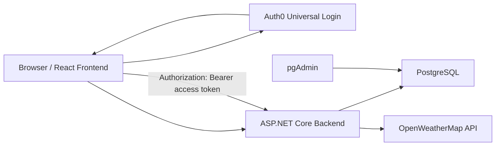

# Weather App

Weather App is a Docker Compose project with a React frontend, an ASP.NET Core backend, PostgreSQL persistence, pgAdmin, Auth0 authentication, and OpenWeatherMap weather data.

## What You Need

- Docker Desktop or Docker Engine with Docker Compose.
- An Auth0 account: https://auth0.com/
- An OpenWeatherMap API key: https://openweathermap.org/api
- A local `.env` file in this repository root. The `.env` file is intentionally ignored by Git.

Do not commit real keys. Use `.env.example` as the template and keep real values only in `.env`.

## Fast Start

Fresh clone, then run one of these from the repository root.

Windows 11:

```powershell
.\start-weather-app.bat
```

Windows PowerShell directly:

```powershell
.\start-weather-app.ps1
```

macOS or Linux:

```sh
sh ./start-weather-app.sh
```

If `.env` already exists, the scripts immediately run Docker Compose and do not ask for values again.

If `.env` does not exist yet, the scripts ask only for:

- Auth0 Domain
- Auth0 Audience, default `https://weather-api`
- Auth0 ClientId
- OpenWeatherMap API key

PostgreSQL, pgAdmin, Auth0 scope, and Auth0 connection names are filled automatically. The scripts write `.env`, then run:

```sh
docker compose up -d
```

The generated PostgreSQL password is stored in `.env`. pgAdmin uses the same generated password by default.

## Manual Start

Copy the example file:

```sh
cp .env.example .env
```

On Windows PowerShell:

```powershell
Copy-Item .env.example .env
```

Fill in `.env`, then start:

```sh
docker compose up -d
```

URLs:

- Frontend: http://localhost:3000
- Backend Swagger: http://localhost:5122/swagger
- pgAdmin: http://localhost:5050
- PostgreSQL host from your computer: `localhost:5432`
- PostgreSQL host from containers/pgAdmin: `db:5432`

## Environment Variables

Required local values in `.env`:

```env
POSTGRES_DB=weather_app
POSTGRES_USER=weather_app
POSTGRES_PASSWORD=your-local-db-password

PGADMIN_DEFAULT_EMAIL=admin@example.com
PGADMIN_DEFAULT_PASSWORD=your-local-pgadmin-password

AUTH0_DOMAIN=your-tenant.region.auth0.com
AUTH0_AUDIENCE=https://weather-api
AUTH0_CLIENT_ID=your-auth0-spa-client-id
AUTH0_SCOPE=openid profile email read:weather

AUTH0_CONNECTION_DATABASE=Username-Password-Authentication
AUTH0_CONNECTION_GOOGLE=google-oauth2
AUTH0_CONNECTION_APPLE=apple
AUTH0_CONNECTION_FACEBOOK=facebook
AUTH0_CONNECTION_GITHUB=github

OPENWEATHERMAP_API_KEY=your-openweathermap-api-key
```

`AUTH0_CLIENT_ID` is the Auth0 Single Page Application client ID. For a React SPA this is not a client secret. Social provider secrets for Google, Apple, Facebook, or GitHub belong in the Auth0 Dashboard connections, not in this repository.

## Auth0 Setup

Create or use an Auth0 tenant.

Create an Auth0 Single Page Application for the frontend:

- Allowed Callback URLs: `http://localhost:3000`
- Allowed Logout URLs: `http://localhost:3000`
- Allowed Web Origins: `http://localhost:3000`
- Grant type: Authorization Code Flow with PKCE

Create an Auth0 API:

- Identifier/Audience: the same value as `AUTH0_AUDIENCE`, for example `https://weather-api`

Enable these Auth0 connections for the application:

- Database connection for username/password login and registration, usually `Username-Password-Authentication`
- Google social connection, usually `google-oauth2`
- Apple social connection, usually `apple`
- Facebook social connection, usually `facebook`
- GitHub social connection, usually `github`

For GitHub login, create a GitHub OAuth App in GitHub Developer Settings, then enter the generated GitHub Client ID and Client Secret into the Auth0 GitHub Social Connection. The project `.env` only needs the Auth0 connection name `github`.

The app uses the Auth0 React SDK in the frontend. Auth0 handles login, registration, password hashing, salts, social login, and token issuing. The backend does not store passwords. The backend validates JWT Bearer access tokens with ASP.NET Core, which is the C# equivalent of reading `Authorization: Bearer ...` in the lecture's FastAPI example.

Answer for the project question: yes, the app uses Auth0 libraries with Authorization Code Flow plus PKCE for the SPA, and the API validates Auth0 JWT Bearer tokens.

## OpenWeatherMap Setup

Create an account at https://openweathermap.org/api and generate an API key. Put it into:

```env
OPENWEATHERMAP_API_KEY=your-openweathermap-api-key
```

The key is passed to the backend by Docker Compose and is not committed.

## Database And pgAdmin

Docker Compose starts:

- `db`: official `postgres:latest`
- `pgadmin`: official `dpage/pgadmin4:latest`

Database files are stored in Docker volumes, not in the local OneDrive project folder. Backend `bin`, backend `obj`, test `bin`, test `obj`, NuGet packages, and frontend `node_modules` also use Docker volumes.

You do not need to create the database manually. `POSTGRES_DB` defaults to `weather_app`, and the official Postgres container creates that database automatically on the first start when the Docker volume is empty. Keeping the default name is easiest because backend and pgAdmin are already configured for it.

Open pgAdmin at http://localhost:5050 and log in with:

- Email: `PGADMIN_DEFAULT_EMAIL`
- Password: `PGADMIN_DEFAULT_PASSWORD`

The server profile `Weather PostgreSQL` is preloaded. If pgAdmin asks for the database password, use `POSTGRES_PASSWORD` from `.env`.

## Features

- Auth0 login and registration.
- Auth0 social login buttons for Google, Apple, Facebook, and GitHub.
- Weather search through the ASP.NET Core API.
- Forecast, UV index, air quality, humidity, wind, sunrise, and sunset.
- Own places/weather stations in the web UI.
- Own station measurements in the web UI.
- Station data is separated by the authenticated Auth0 user.
- PostgreSQL persistence through EF Core ORM.
- No raw SQL queries in app code.

## Backend Persistence

The backend uses EF Core with Npgsql, the C# ORM equivalent to SQLAlchemy from the lecture.

Tables:

- `AppUsers`
- `Cities`
- `SearchHistory`
- `FavoriteCities`
- `WeatherRequestLogs`
- `WeatherStations`
- `WeatherStationMeasurements`

The schema is normalized:

- User identity data is separated from city data.
- City data is separated from station data.
- Measurements are separated from stations.
- Search history, favorites, request logs, stations, and measurements reference users/cities/stations through keys instead of duplicating full records.

EF Core migrations are applied automatically when the backend starts.

## Architecture



## Useful Commands

Start everything:

```sh
docker compose up -d
```

Show containers:

```sh
docker compose ps
```

Stop everything:

```sh
docker compose down
```

Run backend tests in Docker:

```sh
docker compose run --rm --no-TTY backend dotnet test ../weatherAPI.Test/weatherAPI.Test.csproj --verbosity minimal
```

## Cross-Platform Notes

The stack is designed for Windows, Linux, and macOS. PostgreSQL runs natively on amd64/x86_64 and ARM64, including Mac with M-chip, so no SQL Server amd64 emulation is needed.

Use the `.sh` script on macOS/Linux and the `.bat` or `.ps1` script on Windows.
